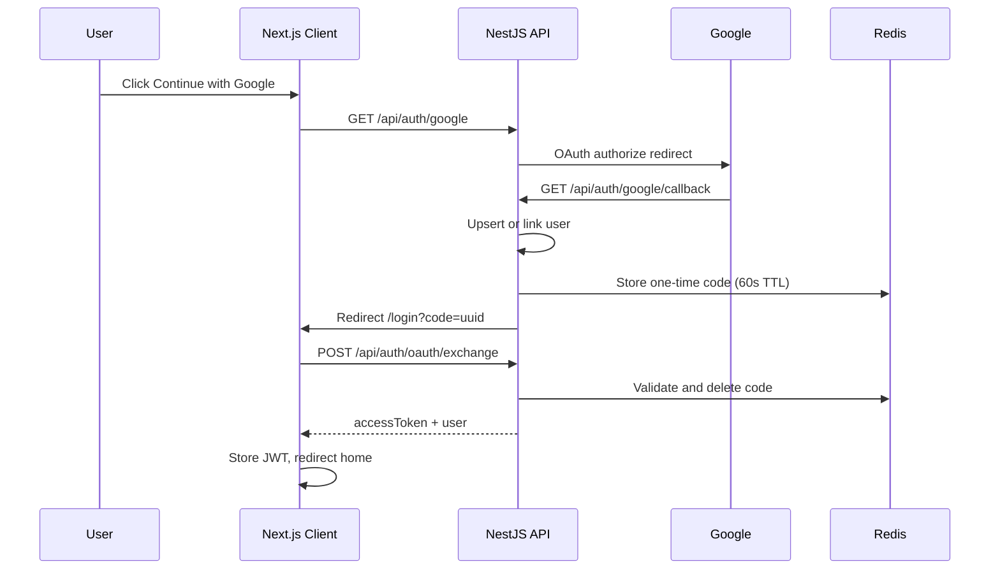

# Google OAuth Sign-In

This document describes how Google OAuth 2.0 sign-in works in the AI Meeting Assistant, how accounts are linked, and what you need to configure.

## Overview

The app supports two sign-in methods:

| Method | Endpoint | Session |
|--------|----------|---------|
| Email / password | `POST /api/auth/login` | JWT Bearer token |
| Google OAuth 2.0 | `GET /api/auth/google` → callback → code exchange | Same JWT model |

OAuth 2.0 uses the **Authorization Code flow** on the server via `passport-google-oauth20`. The browser never sees the Google client secret. After Google authenticates the user, the server issues a JWT—the same token type used for email/password login.

## Architecture



### Why a one-time code?

The server no longer puts the JWT in the URL query string. A short-lived, single-use code is stored in Redis and exchanged via `POST /api/auth/oauth/exchange`. This avoids leaking tokens in browser history, server logs, or `Referer` headers.

## Account linking rules

Accounts are matched by **verified Google email** and `googleId`.

| Scenario | Result |
|----------|--------|
| New Google user | Creates user with `provider: google`, `googleId` set, no password |
| Local account exists with same email | Links `googleId` to existing user; **password login still works** |
| Google-only user tries email/password login | `401` with code `GOOGLE_AUTH_REQUIRED` |
| Google-only email used on register form | `409` with code `GOOGLE_ACCOUNT_EXISTS` |
| User cancels or fails Google OAuth | Redirect to `/login?error=google_auth_failed` |

The `provider` field indicates how the account was **originally created** (`local` or `google`). Linking Google to a local account does not change `provider` from `local`.

## API endpoints

| Method | Path | Auth | Description |
|--------|------|------|-------------|
| `GET` | `/api/auth/google` | Public | Starts Google OAuth redirect |
| `GET` | `/api/auth/google/callback` | Public | Google callback; redirects to frontend with `?code=` |
| `POST` | `/api/auth/oauth/exchange` | Public | Body: `{ "code": "uuid" }` → `{ accessToken, user }` |
| `POST` | `/api/auth/login` | Public | Email/password login |
| `POST` | `/api/auth/register` | Public | Email/password registration |
| `GET` | `/api/auth/me` | JWT required | Current user profile |

### Error codes

| Code | HTTP | When |
|------|------|------|
| `GOOGLE_AUTH_REQUIRED` | 401 | Password login attempted on Google-only account |
| `GOOGLE_ACCOUNT_EXISTS` | 409 | Register attempted with email already used via Google |
| `OAUTH_CODE_INVALID` | 401 | Exchange code missing, expired, or already used |

## What you need to configure

### 1. Google Cloud Console

1. Open [Google Cloud Console](https://console.cloud.google.com/) → **APIs & Services** → **Credentials**.
2. Configure the **OAuth consent screen** (External for production; add test users during development).
3. Create an **OAuth 2.0 Client ID** → type **Web application**.
4. Add **Authorized redirect URIs** (must match exactly):

| Environment | Redirect URI |
|-------------|--------------|
| Local dev | `http://localhost:4000/api/auth/google/callback` |
| Production | `https://<your-api-domain>/api/auth/google/callback` |

5. Copy the **Client ID** and **Client Secret**.

Scopes used: `email`, `profile` (sign-in only; no Gmail API access).

### 2. Server environment variables

Add to `server/.env` (see `server/.env.example`):

```env
JWT_SECRET=generate-a-long-random-string-min-32-chars
JWT_EXPIRES_IN=7d

GOOGLE_CLIENT_ID=your-google-client-id
GOOGLE_CLIENT_SECRET=your-google-client-secret
GOOGLE_CALLBACK_URL=http://localhost:4000/api/auth/google/callback
FRONTEND_URL=http://localhost:3000

REDIS_URL=redis://localhost:6379
```

| Variable | Purpose |
|----------|---------|
| `GOOGLE_CLIENT_ID` | OAuth client ID from Google Cloud |
| `GOOGLE_CLIENT_SECRET` | OAuth client secret (server only) |
| `GOOGLE_CALLBACK_URL` | Must match Google Console redirect URI |
| `FRONTEND_URL` | Where to redirect after OAuth (Next.js app) |
| `JWT_SECRET` | Signs session tokens; use a strong random value in production |
| `REDIS_URL` | Stores one-time OAuth exchange codes (same Redis as BullMQ) |

### 3. Client environment variables

Add to `client/.env.local` (see `client/.env.example`):

```env
NEXT_PUBLIC_API_URL=http://localhost:4000/api
```

Must include the `/api` prefix. The Google button links to `{NEXT_PUBLIC_API_URL}/auth/google`.

### 4. Docker Compose

`docker-compose.yml` sets:

- `FRONTEND_URL=http://localhost:3000`
- `GOOGLE_CALLBACK_URL=http://localhost:4000/api/auth/google/callback`
- `NEXT_PUBLIC_API_URL=http://localhost:4000/api` (client build arg)

Put `GOOGLE_CLIENT_ID` and `GOOGLE_CLIENT_SECRET` in `server/.env` (loaded via `env_file`).

### 5. Production checklist

- [ ] Create production OAuth client or add production redirect URI
- [ ] Set strong `JWT_SECRET` (never use `changeme`)
- [ ] Set `GOOGLE_CALLBACK_URL` to production API URL
- [ ] Set `FRONTEND_URL` to production client URL
- [ ] Set `CLIENT_URL` for CORS (same as frontend origin)
- [ ] Ensure Redis is available (`REDIS_URL`)
- [ ] Publish OAuth consent screen if using External user type

## Security notes

- Google **client secret** stays on the server only.
- Only **verified** Google emails are accepted.
- Account linking by email requires a verified Google email matching an existing account.
- Password login for unknown emails returns a generic error (no email enumeration).
- Google-only accounts get an explicit error code so the UI can suggest Google sign-in.
- JWT is stored in `localStorage` (same as email login). HttpOnly cookies are a possible future hardening step.
- `passwordHash` is never returned from API responses (`select: false` on the User entity).

## Key source files

### Server

| File | Role |
|------|------|
| `server/src/auth/strategies/google.strategy.ts` | Passport Google OAuth strategy |
| `server/src/auth/guards/google-oauth.guard.ts` | OAuth guard with failure redirect |
| `server/src/auth/auth-oauth-code.service.ts` | Redis one-time code storage |
| `server/src/auth/auth.service.ts` | Login, register, googleLogin, exchange |
| `server/src/auth/auth.controller.ts` | HTTP routes |
| `server/src/auth/dto/exchange-oauth-code.dto.ts` | Exchange request validation |

### Client

| File | Role |
|------|------|
| `client/src/lib/auth-urls.ts` | Google OAuth start URL |
| `client/src/lib/api/auth.ts` | Auth API client |
| `client/src/app/(auth)/login/page.tsx` | Code exchange + error UX |
| `client/src/types/auth.ts` | Shared auth types and error codes |

## Manual test matrix

| # | Steps | Expected |
|---|-------|----------|
| 1 | Register with email/password → Continue with Google (same email) | One account; both login methods work |
| 2 | Continue with Google (new email) → try password login | Message: use Google Sign-In |
| 3 | Continue with Google → try register with same email | Message: sign in with Google |
| 4 | Cancel Google OAuth | Error on login page |
| 5 | Complete Google OAuth | Home page; no JWT in browser URL |

## Verify locally

```bash
# Start Redis + apps
docker-compose up --build -d

# Or run separately
cd server && npm run start:dev
cd client && npm run dev

# Run auth unit tests
cd server && npm test -- auth.service.spec
```

Ensure `server/.env` has valid Google credentials and Redis is running before testing the full OAuth flow.
